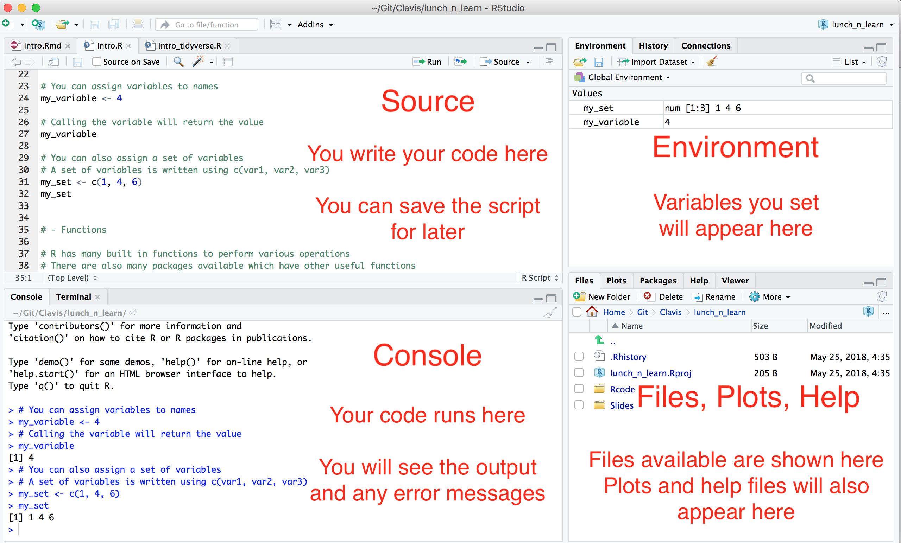

```{r setup, include=FALSE}
knitr::opts_chunk$set(echo = FALSE)
```

## R & RStudio


- [R](https://www.r-project.org/) is a free software environment 
    - Originally R was developed for statistical computing and graphics.
    - Now R is also used to create dynamic documents, presentaions and dashboards.

<br>

- [RStudio](https://www.rstudio.com/) is a GUI which makes it easier to edit R scripts and display visualisations.

<br>

- Download both R and RStudio. 
    - [https://www.r-project.org/](https://www.r-project.org/)
    - [https://www.rstudio.com/](https://www.rstudio.com/)

## RStudio Layout

<center></center>
<!-- {width=50px} -->

## R Script

- Download the R script [intro.R](/Rcode/intro_tidyverse.R)
- Double click on the file and it should open in RStudio, continue there!


## Tidyverse

- We will cover the set of packages know as the *tidyverse* [https://www.tidyverse.org/](https://www.tidyverse.org/).
- These pacakges contain many useful functions for cleaning, manipulating and visualising data.

<br>

- A very useful resource is the [R for Data Science](http://r4ds.had.co.nz/index.html) book which is available for free online.
- This book covers many of the tidyverse packages and we will look at examples from this book.

<br>

- Download the tidyverse intro R script [intro_tidyverse.R](/Rcode/intro_tidyverse.R)


