Visualisation
================
Aidan Boland
26/5/2018

ggplot2
-------

<br> <br>

-   For creating plots of data we will use the [ggplot2](http://ggplot2.tidyverse.org/) package.
-   We will follow the [data visualisation](http://r4ds.had.co.nz/data-visualisation.html) chapter from the [R for Data Science](http://r4ds.had.co.nz/index.html) book.

mpg Data
--------

-   `mpg` contains observations collected by the US Environment Protection Agency on 38 models of car

<br>
<center>
    ## # A tibble: 234 x 11
    ##    manufacturer model    displ  year   cyl trans   drv     cty   hwy fl   
    ##    <chr>        <chr>    <dbl> <int> <int> <chr>   <chr> <int> <int> <chr>
    ##  1 audi         a4         1.8  1999     4 auto(l… f        18    29 p    
    ##  2 audi         a4         1.8  1999     4 manual… f        21    29 p    
    ##  3 audi         a4         2    2008     4 manual… f        20    31 p    
    ##  4 audi         a4         2    2008     4 auto(a… f        21    30 p    
    ##  5 audi         a4         2.8  1999     6 auto(l… f        16    26 p    
    ##  6 audi         a4         2.8  1999     6 manual… f        18    26 p    
    ##  7 audi         a4         3.1  2008     6 auto(a… f        18    27 p    
    ##  8 audi         a4 quat…   1.8  1999     4 manual… 4        18    26 p    
    ##  9 audi         a4 quat…   1.8  1999     4 auto(l… 4        16    25 p    
    ## 10 audi         a4 quat…   2    2008     4 manual… 4        20    28 p    
    ## # ... with 224 more rows, and 1 more variable: class <chr>

</center>
mpg Data
--------

-   `mpg` contains observations collected by the US Environment Protection Agency on 38 models of car

<br>

-   We will begin with the relationship between engine size (`displ`) and fuel efficiency (`hwy`)
-   What would you expect the reationship to be?

Basic Scatterplot
-----------------

``` r
ggplot(data = mpg) + 
  geom_point(mapping = aes(x = displ, y = hwy))
```

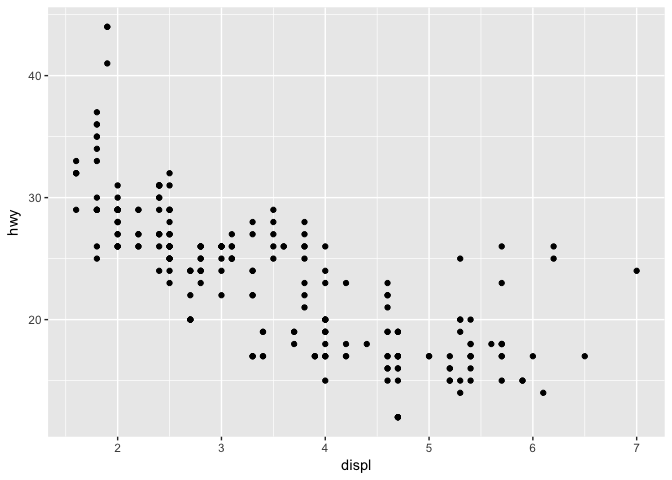

Plot Template
-------------

``` r
ggplot(data = <DATA>) + 
  <GEOM_FUNCTION>(mapping = aes(<MAPPINGS>))
```

-   The ggplot2 template takes the above form
-   The data is passed as part of the ggplot function
-   The type of graph is defined by the function which follows (`<GEOM_FUNCTION>`)
    -   We have seen previously the `geom_point` function which creates a scatterplot
    -   There are different functions which create other type of graphs such as a bar chart `geom_bar`
-   The `<MAPPINGS>` component defines whihc variables are plotted and can control other parts of the graph like the colour, size, etc...

Scatterplot with Colour
-----------------------

``` r
ggplot(data = mpg) + 
  geom_point(mapping = aes(x = displ, y = hwy, colour = class))
```

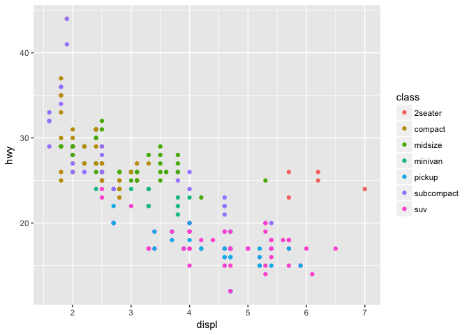

Scatterplot with Shade
----------------------

``` r
ggplot(data = mpg) + 
  geom_point(mapping = aes(x = displ, y = hwy, alpha = class))
```

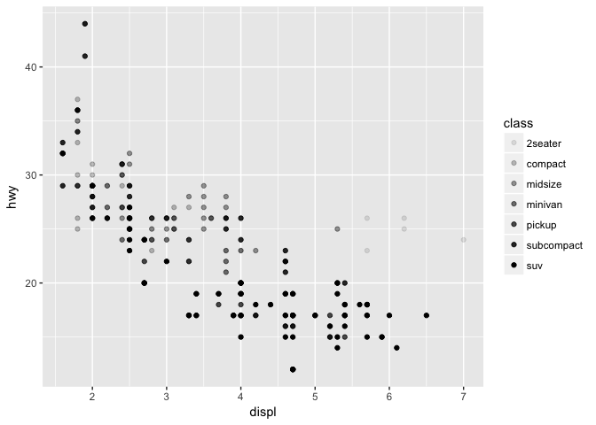

Scatterplot with Shape
----------------------

``` r
ggplot(data = mpg) + 
  geom_point(mapping = aes(x = displ, y = hwy, shape = class))
```

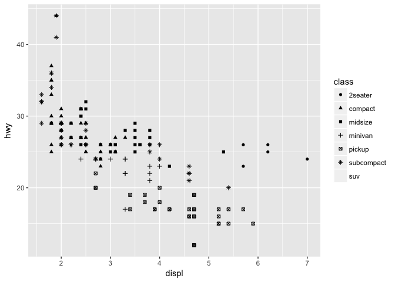

<!-- ## Different geom Types -->
<!-- ```{r bar1_car, echo = TRUE, fig.align='center'} -->
<!-- ggplot(data = mpg) +  -->
<!--   geom_bar(mapping = aes(x = class)) -->
<!-- ``` -->
<!-- ## Barplot -->
<!-- ```{r bar2_car, echo = TRUE, fig.align='center'} -->
<!-- ggplot(data = mpg) +  -->
<!--   geom_bar(mapping = aes(x = class, fill = class)) -->
<!-- ``` -->
<!-- ## Barplot -->
<!-- ```{r bar3_car, echo = TRUE, fig.align='center'} -->
<!-- ggplot(data = mpg) +  -->
<!--   geom_bar(mapping = aes(x = class, fill = trans)) -->
<!-- ``` -->
Different geom Types
--------------------

-   `geom_point` scatterplot
-   `geom_bar` barplot
-   `geom_histogram` histogram

Diamonds data
-------------

<br>
<center>
    ## # A tibble: 53,940 x 10
    ##    carat cut       color clarity depth table price     x     y     z
    ##    <dbl> <ord>     <ord> <ord>   <dbl> <dbl> <int> <dbl> <dbl> <dbl>
    ##  1 0.23  Ideal     E     SI2      61.5    55   326  3.95  3.98  2.43
    ##  2 0.21  Premium   E     SI1      59.8    61   326  3.89  3.84  2.31
    ##  3 0.23  Good      E     VS1      56.9    65   327  4.05  4.07  2.31
    ##  4 0.290 Premium   I     VS2      62.4    58   334  4.2   4.23  2.63
    ##  5 0.31  Good      J     SI2      63.3    58   335  4.34  4.35  2.75
    ##  6 0.24  Very Good J     VVS2     62.8    57   336  3.94  3.96  2.48
    ##  7 0.24  Very Good I     VVS1     62.3    57   336  3.95  3.98  2.47
    ##  8 0.26  Very Good H     SI1      61.9    55   337  4.07  4.11  2.53
    ##  9 0.22  Fair      E     VS2      65.1    61   337  3.87  3.78  2.49
    ## 10 0.23  Very Good H     VS1      59.4    61   338  4     4.05  2.39
    ## # ... with 53,930 more rows

</center>
Barplot
-------

``` r
ggplot(data = diamonds) + 
  geom_bar(mapping = aes(x = cut))
```

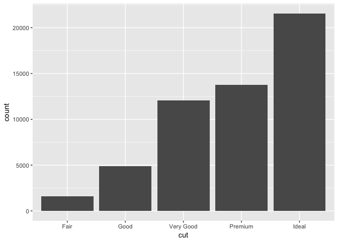

Barplot - Category by colour
----------------------------

``` r
ggplot(data = diamonds) + 
  geom_bar(mapping = aes(x = cut, fill = cut))
```

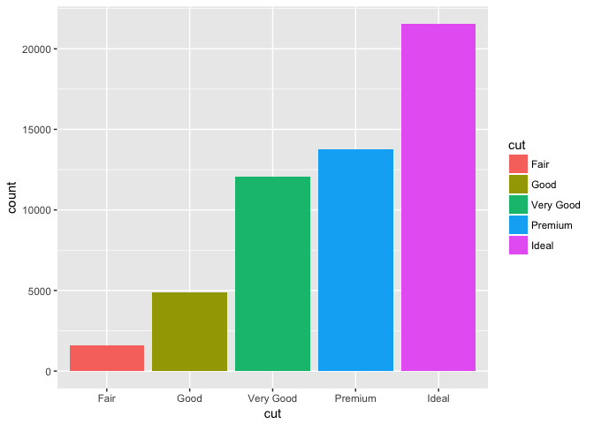

Barplot - Fill using another variable
-------------------------------------

``` r
ggplot(data = diamonds) + 
  geom_bar(mapping = aes(x = cut, fill = clarity))
```

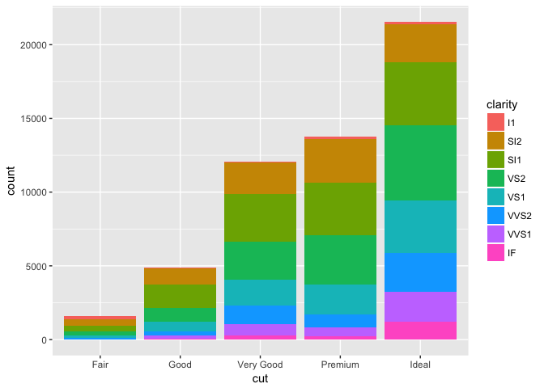

Barplot - Fill using another variable
-------------------------------------

``` r
ggplot(data = diamonds) + 
  geom_bar(mapping = aes(x = cut, fill = clarity), position = "fill")
```

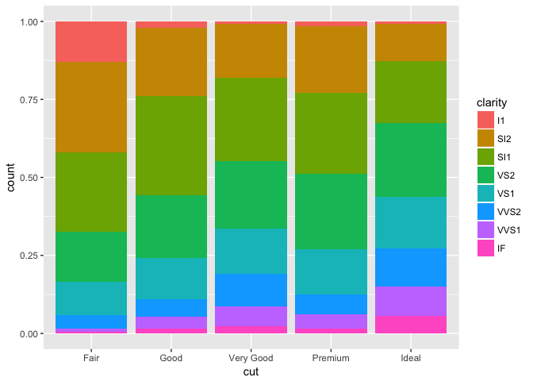

Barplot - Fill using another variable
-------------------------------------

``` r
ggplot(data = diamonds) + 
  geom_bar(mapping = aes(x = cut, fill = clarity), position = "dodge")
```

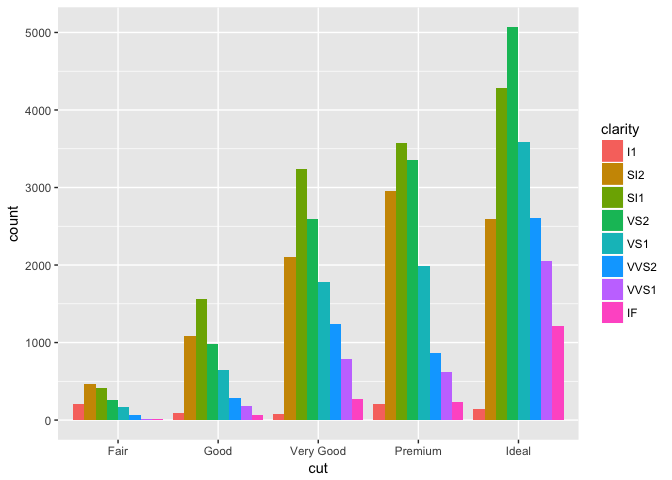

Histogram
---------

``` r
ggplot(diamonds, aes(carat)) +
  geom_histogram(binwidth = 0.01)
```

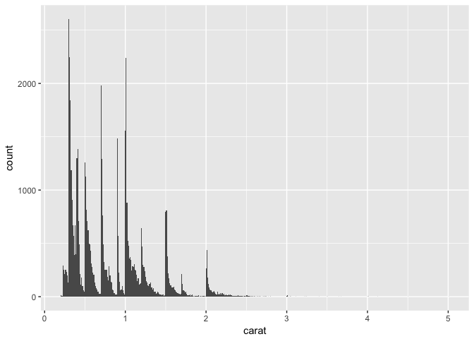

Histogram
---------

``` r
ggplot(diamonds, aes(price, fill = cut)) +
  geom_histogram(binwidth = 500)
```

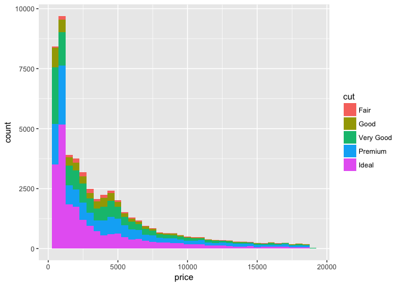
