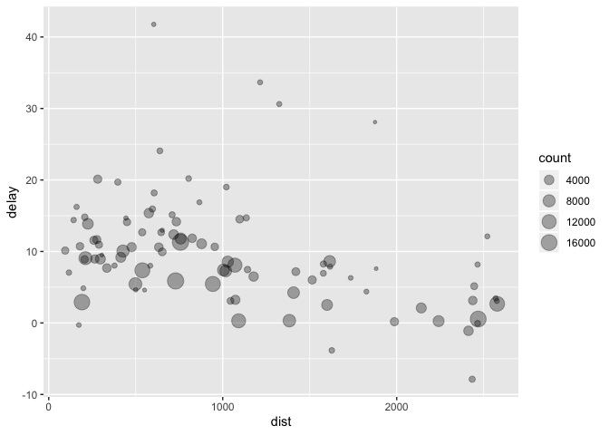
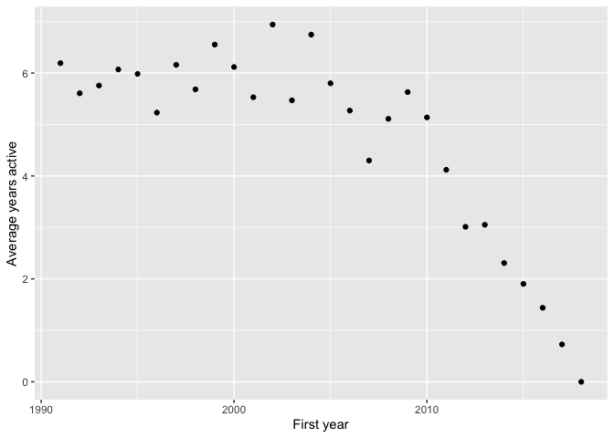
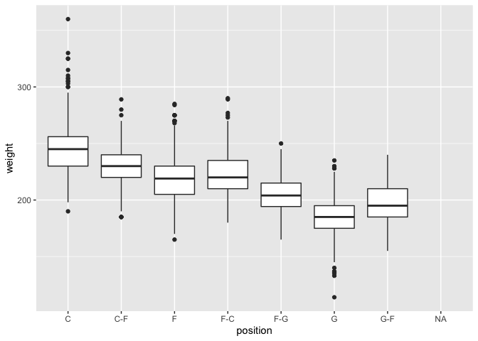
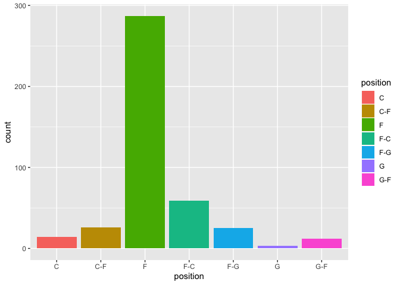
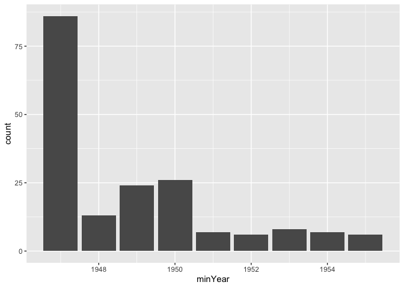

# Tutorial 3: Transformation

## Introduction

This tutorial will show you how to read in datasets to R, save datasets
as files and deal with missing data. We will also look at the
`filter()`, `arrange()` and `select()` functions which are useful for
data transformation. We will also look at the `group_by()` and
`summarise()` functions which are useful for creating summary
statistics. We will finish off looking at the concept of the pipe
operator which helps to create *readable* code.

### Loading Datasets

  - The function used to read in the individual files depends on the
    file type. We will look at some functions included in the `readr`
    pacakge.

  - `read_csv()` reads comma delimited files, `read_csv2()` reads
    semicolon separated files (common in countries where , is used as
    the decimal place), `read_tsv()` reads tab delimited files, and
    `read_delim()` reads in files with any delimiter.
    
      - There are many arguments you can use dependin on the structure
        of your file.
      - You can use `col_names = FALSE` to tell `read_csv()` not to
        treat the first row as headings

  - `load()` is a base function used for reading in `.Rdata` files.

  - In the examples below we are reading directly from the Github
    repository online.  

  - **In practice you will be reading from a location on your local
    machine.**
    
      - e.g. `read_tsv("user/downloads/pulse.txt")`

<!-- end list -->

``` r
pulseData <- read_tsv("https://raw.githubusercontent.com/aboland/TutoR/master/Tutorial_03_Transformation/pulse.txt")
pulseData
```

    ## # A tibble: 92 x 3
    ##    RestingPulse Smokes Weight
    ##    <chr>        <chr>   <dbl>
    ##  1 Low          No        140
    ##  2 Low          <NA>      145
    ##  3 Low          Yes       160
    ##  4 Low          Yes       190
    ##  5 Low          No        155
    ##  6 Low          No        165
    ##  7 <NA>         No        150
    ##  8 Low          No        190
    ##  9 Low          No        195
    ## 10 Low          No        138
    ## # … with 82 more rows

``` r
fastFoodData <- read_csv("https://raw.githubusercontent.com/aboland/TutoR/master/Tutorial_03_Transformation/fastfood_calories.csv", col_names = TRUE)

fastFoodData
```

    ## # A tibble: 515 x 18
    ##       X1 restaurant item  calories cal_fat total_fat sat_fat trans_fat
    ##    <dbl> <chr>      <chr>    <dbl>   <dbl>     <dbl>   <dbl>     <dbl>
    ##  1     1 Mcdonalds  Arti…      380      60         7       2       0  
    ##  2     2 Mcdonalds  Sing…      840     410        45      17       1.5
    ##  3     3 Mcdonalds  Doub…     1130     600        67      27       3  
    ##  4     4 Mcdonalds  Gril…      750     280        31      10       0.5
    ##  5     5 Mcdonalds  Cris…      920     410        45      12       0.5
    ##  6     6 Mcdonalds  Big …      540     250        28      10       1  
    ##  7     7 Mcdonalds  Chee…      300     100        12       5       0.5
    ##  8     8 Mcdonalds  Clas…      510     210        24       4       0  
    ##  9     9 Mcdonalds  Doub…      430     190        21      11       1  
    ## 10    10 Mcdonalds  Doub…      770     400        45      21       2.5
    ## # … with 505 more rows, and 10 more variables: cholesterol <dbl>,
    ## #   sodium <dbl>, total_carb <dbl>, fiber <dbl>, sugar <dbl>,
    ## #   protein <dbl>, vit_a <dbl>, vit_c <dbl>, calcium <dbl>, salad <chr>

``` r
load(url("https://raw.githubusercontent.com/aboland/TutoR/master/Tutorial_03_Transformation/olive.Rdata?raw=true"))
head(olive) 
```

    ##   area region palmitic palmitoleic stearic oleic linoleic linolenic
    ## 1    1      1     1075          75     226  7823      672        36
    ## 2    1      1     1088          73     224  7709      781        31
    ## 3    1      1      911          54     246  8113      549        31
    ## 4    1      1      966          57     240  7952      619        50
    ## 5    1      1     1051          67     259  7771      672        50
    ## 6    1      1      911          49     268  7924      678        51
    ##   arachidic eicosenoic
    ## 1        60         29
    ## 2        61         29
    ## 3        63         29
    ## 4        78         35
    ## 5        80         46
    ## 6        70         44

  - When reading in data, it is useful to assign names to the input as
    then the datasets can easily be included in other
functions.

<!-- -   As the files were saved in the working directory **R Tutorials**, only the file name was needed in the function. However, if the file was saved in another location, the full filepath would need to be included e.g. `read.table("user/downloads/pulse.txt")`. You must use forward slashes in the file path, R will return an error if backwards slashes are used. -->

### Saving Datasets

  - It is also possible to save datasets created or worked on in R as
    files.

  - The `write_delim()` function can be used to do this. The function
    takes the form `write_delim(x, path, delim)` where `x` is the name
    of the dataset in R and `path` is name of the file you wish to
    create. The `delim` parameter is the method by which each row of
    data is separated in the resulting file, with the default separator
    set to a space.
    
      - Since this is an interactive tutorial we won’t run the
        write.table command.
      - `write_delim(pulseData, path = "savedPulse.csv", delim = "\t")`
        would save the `pulseData` data as a tab separated file.

  - The `write_csv()` is an alternative function which will save the
    data in a comma separated form. The function takes the form
    `write_csv(x, file,)` where `x` is the name of the dataset in R and
    `path` is name of the file you wish to create.

## Missing Data

  - Datasets often can contain missing data.

  - The `complete.cases()` function is used to identify the rows of data
    which are complete i.e. do not contain missing data.

  - Sometimes it is helpful to take a closer look at cases with missing
    data as opposed to just deleting them.

  - Run the following code to find any missing data in the `pulseData`
    dataframe and save them in a new dataframe called `missingData`.

<!-- end list -->

``` r
missingData <- filter(pulseData, !complete.cases(pulseData))
```

  - The `!` in R is a negative operator, i.e. the code above is
    searching for cases that are **not** complete.

  - We will cover the `filter` function in the next section.

### Analysing the Missing Data

  - The `summary()` function is useful for quickly analysing a dataset.

<!-- end list -->

``` r
summary(missingData)
```

    ##  RestingPulse          Smokes              Weight     
    ##  Length:7           Length:7           Min.   :125.0  
    ##  Class :character   Class :character   1st Qu.:128.2  
    ##  Mode  :character   Mode  :character   Median :139.0  
    ##                                        Mean   :137.2  
    ##                                        3rd Qu.:143.8  
    ##                                        Max.   :150.0  
    ##                                        NA's   :1

### Removing Missing Data

  - After analysing the cases which contain missing elements, sometimes
    we then wish to remove them from our original dataset.

#### Exercise 1

**Use the `complete.cases()` function to create a new dataframe called
`cleanPulseData` which contains no missing data.**

[Exercise 1 Solution](#exercise-1-solution)

<br>

  - An alternative method of removing missing data is to use the
    `na.omit()` function:
      - Note how the use of `na.omit` differs to `complete.cases`
      - It is a standalone function which returns a dataset

<!-- end list -->

``` r
cleanPulseData <- na.omit(pulseData)
cleanPulseData
```

    ## # A tibble: 85 x 3
    ##    RestingPulse Smokes Weight
    ##    <chr>        <chr>   <dbl>
    ##  1 Low          No        140
    ##  2 Low          Yes       160
    ##  3 Low          Yes       190
    ##  4 Low          No        155
    ##  5 Low          No        165
    ##  6 Low          No        190
    ##  7 Low          No        195
    ##  8 Low          No        138
    ##  9 High         Yes       160
    ## 10 Low          No        155
    ## # … with 75 more rows

<br><br>

## Data Transformation

  - The `filter()`, `arrange()` and `select()` functions are from the
    `dplyr` package which is a member of the `tidyverse` packages.

### `filter()`

  - The `filter()` function allows you to easily subset observations
    based on their values.

  - There are a number of different comparison operators which can be
    used.
    
      - `<`, `>` less than, greater than.
      - `<=`, `>=` less than or equal to, greater than or equal to.
      - `==` equal to.
      - `!=` not equal.

  - The data to be subsetted is first specified and the subsequent
    arguments are the expressions that filter the data frame.

  - For example, you may wish to create a subset of cases from
    `cleanPulseData` containing only individuals who smoke and weigh
    over 160.

<!-- end list -->

``` r
smokersOver160 <- filter(cleanPulseData, 
                         RestingPulse == "Low", 
                         Smokes == "Yes", 
                         Weight > 160)
smokersOver160
```

    ## # A tibble: 8 x 3
    ##   RestingPulse Smokes Weight
    ##   <chr>        <chr>   <dbl>
    ## 1 Low          Yes       190
    ## 2 Low          Yes       175
    ## 3 Low          Yes       170
    ## 4 Low          Yes       180
    ## 5 Low          Yes       185
    ## 6 Low          Yes       170
    ## 7 Low          Yes       190
    ## 8 Low          Yes       164

#### Exercise 2

**Create a subset from `cleanPulseData` which contains individuals with
a low resting pulse who do not smoke and weight less than 180. Name the
subset `lowRateNonSmokers`.**

[Exercise 2 Solution](#exercise-2-solution)

<br>

#### Exercise 3

**Create a subset containing individuals with a weight that is less than
or equal to 170.**

[Exercise 3 Solution](#exercise-3-solution)

<br>

### `arrange()`

  - The `arrange()` function sorts and orders the contents of a
    dataframe.

<!-- end list -->

``` r
weightOrder <- arrange(cleanPulseData, Weight)
weightOrder
```

    ## # A tibble: 85 x 3
    ##    RestingPulse Smokes Weight
    ##    <chr>        <chr>   <dbl>
    ##  1 High         No         95
    ##  2 Low          No        102
    ##  3 Low          Yes       108
    ##  4 Low          No        108
    ##  5 Low          No        110
    ##  6 Low          Yes       112
    ##  7 Low          No        115
    ##  8 Low          No        115
    ##  9 High         No        116
    ## 10 High         No        116
    ## # … with 75 more rows

  - The data frame is arranged in ascending order by default. However,
    you can sort the data by descending order using the following code:

<!-- end list -->

``` r
weightOrderDesc <- arrange(cleanPulseData, desc(Weight))
weightOrderDesc
```

    ## # A tibble: 85 x 3
    ##    RestingPulse Smokes Weight
    ##    <chr>        <chr>   <dbl>
    ##  1 Low          No        215
    ##  2 Low          No        195
    ##  3 Low          Yes       190
    ##  4 Low          No        190
    ##  5 Low          No        190
    ##  6 Low          Yes       190
    ##  7 Low          Yes       185
    ##  8 Low          Yes       180
    ##  9 High         Yes       180
    ## 10 Low          No        180
    ## # … with 75 more rows

  - It is also possible to include more than one column name in the
    `arrange()` function.

<!-- end list -->

``` r
smokesAndPulseOrder <- arrange(cleanPulseData, Smokes, RestingPulse)
smokesAndPulseOrder
```

    ## # A tibble: 85 x 3
    ##    RestingPulse Smokes Weight
    ##    <chr>        <chr>   <dbl>
    ##  1 High         No        116
    ##  2 High         No        155
    ##  3 High         No        145
    ##  4 High         No        136
    ##  5 High         No        130
    ##  6 High         No        118
    ##  7 High         No        116
    ##  8 High         No         95
    ##  9 High         No        150
    ## 10 Low          No        140
    ## # … with 75 more rows

#### Exercise 4

**Run the above function again but this time input `RestingPulse` into
the function before `Smokes`. What effect does this have on the
resulting dataset.**

[Exercise 4 Solution](#exercise-4-solution)

<br>

### `select()`

  - The `select()` function allows you select only the variables you are
    interested in from a data frame.

  - For example, some datasets may contain hundreds of variables but you
    may only wish to analyse a few of them.

  - `fastFoodData` has 18 variables for each of its 515 observations.
    The code below shows how the `select()` function can be used to
    create a new dataset with less variables.

<!-- end list -->

``` r
fastFoodDataSimplified <- select(fastFoodData, 
                                 restaurant, 
                                 item, 
                                 calories)
head(fastFoodDataSimplified)
```

    ## # A tibble: 6 x 3
    ##   restaurant item                                      calories
    ##   <chr>      <chr>                                        <dbl>
    ## 1 Mcdonalds  Artisan Grilled Chicken Sandwich               380
    ## 2 Mcdonalds  Single Bacon Smokehouse Burger                 840
    ## 3 Mcdonalds  Double Bacon Smokehouse Burger                1130
    ## 4 Mcdonalds  Grilled Bacon Smokehouse Chicken Sandwich      750
    ## 5 Mcdonalds  Crispy Bacon Smokehouse Chicken Sandwich       920
    ## 6 Mcdonalds  Big Mac                                        540

#### Exercise 5

**Use the `select()` function to create a data frame called
`fastFoodNutrition` which contains the variables `restaurant`, `item`,
`calories`, `total_fat`, `sugar` and `protein`.**

[Exercise 5 Solution](#exercise-5-solution)

    ## # A tibble: 515 x 6
    ##    restaurant item                         calories total_fat sugar protein
    ##    <chr>      <chr>                           <dbl>     <dbl> <dbl>   <dbl>
    ##  1 Mcdonalds  Artisan Grilled Chicken San…      380         7    11      37
    ##  2 Mcdonalds  Single Bacon Smokehouse Bur…      840        45    18      46
    ##  3 Mcdonalds  Double Bacon Smokehouse Bur…     1130        67    18      70
    ##  4 Mcdonalds  Grilled Bacon Smokehouse Ch…      750        31    18      55
    ##  5 Mcdonalds  Crispy Bacon Smokehouse Chi…      920        45    18      46
    ##  6 Mcdonalds  Big Mac                           540        28     9      25
    ##  7 Mcdonalds  Cheeseburger                      300        12     7      15
    ##  8 Mcdonalds  Classic Chicken Sandwich          510        24     6      25
    ##  9 Mcdonalds  Double Cheeseburger               430        21     7      25
    ## 10 Mcdonalds  Double Quarter Pounder® wit…      770        45    10      51
    ## # … with 505 more rows

<br><br>

## More Transformations

    ## The `playerData` dataset can be read in as follows.

``` r
playerData <- read_csv("https://raw.githubusercontent.com/aboland/TutoR/master/Tutorial_03_Transformation/player_data.csv")
playerData
```

    ## # A tibble: 4,550 x 8
    ##    name    year_start year_end position height weight birth_date  college  
    ##    <chr>        <dbl>    <dbl> <chr>    <chr>   <dbl> <chr>       <chr>    
    ##  1 Alaa A…       1991     1995 F-C      6-10      240 June 24, 1… Duke Uni…
    ##  2 Zaid A…       1969     1978 C-F      6-9       235 April 7, 1… Iowa Sta…
    ##  3 Kareem…       1970     1989 C        7-2       225 April 16, … Universi…
    ##  4 Mahmou…       1991     2001 G        6-1       162 March 9, 1… Louisian…
    ##  5 Tariq …       1998     2003 F        6-6       223 November 3… San Jose…
    ##  6 Sharee…       1997     2008 F        6-9       225 December 1… Universi…
    ##  7 Tom Ab…       1977     1981 F        6-7       220 May 6, 1954 Indiana …
    ##  8 Forest…       1957     1957 G        6-3       180 July 27, 1… Western …
    ##  9 John A…       1947     1948 F        6-3       195 February 9… Salem In…
    ## 10 Alex A…       2017     2018 G-F      6-6       190 August 1, … <NA>     
    ## # … with 4,540 more rows

There are further helpful functions for data transformation such as
`mutate()`, `transmutate()`, `group_by()` and `ungroup()`. These
functions will then be used in conjunction with functions from the
previous section.

### `mutate()`

  - The `mutate()` function allows you create new columns (variables)
    that are functions of existing columns and adds them to the
    dataframe.

  - For example, the `playerData` dataset has two variables `year_start`
    and `year_end` which represent the year a player started their
    career and the year they stopped playing professionally. It is
    therefore possible to add a new column `years_active` to the
    existing dataset by doing the following:

<!-- end list -->

``` r
playerData <- mutate(playerData, years_active = year_end - year_start)

playerData_select <- select(playerData, name, years_active)
playerData_select
```

    ## # A tibble: 4,550 x 2
    ##    name                years_active
    ##    <chr>                      <dbl>
    ##  1 Alaa Abdelnaby                 4
    ##  2 Zaid Abdul-Aziz                9
    ##  3 Kareem Abdul-Jabbar           19
    ##  4 Mahmoud Abdul-Rauf            10
    ##  5 Tariq Abdul-Wahad              5
    ##  6 Shareef Abdur-Rahim           11
    ##  7 Tom Abernethy                  4
    ##  8 Forest Able                    0
    ##  9 John Abramovic                 1
    ## 10 Alex Abrines                   1
    ## # … with 4,540 more rows

  - It is possible to create multiple new variables within the same
    `mutate()` function using the following format: `mutate(data,
    newVariable1, newVariable2, newVariable3, ...)`.

### `transmute()`

  - If you only wish to keep the new variables you have created, you can
    do so using the `transmute()` function as shown
below:

<!-- end list -->

``` r
playerData_select <- transmute(playerData, years_active = year_end - year_start)
playerData_select
```

    ## # A tibble: 4,550 x 1
    ##    years_active
    ##           <dbl>
    ##  1            4
    ##  2            9
    ##  3           19
    ##  4           10
    ##  5            5
    ##  6           11
    ##  7            4
    ##  8            0
    ##  9            1
    ## 10            1
    ## # … with 4,540 more rows

<br><br>

### NYC Flights

  - The [nycflights13](https://github.com/hadley/nycflights13) data
    contains information about all flights that departed from NYC
    (e.g. EWR, JFK and LGA) in 2013 (336,776 flights in total).

<!-- end list -->

``` r
library(nycflights13)
flights
```

    ## # A tibble: 336,776 x 19
    ##     year month   day dep_time sched_dep_time dep_delay arr_time
    ##    <int> <int> <int>    <int>          <int>     <dbl>    <int>
    ##  1  2013     1     1      517            515         2      830
    ##  2  2013     1     1      533            529         4      850
    ##  3  2013     1     1      542            540         2      923
    ##  4  2013     1     1      544            545        -1     1004
    ##  5  2013     1     1      554            600        -6      812
    ##  6  2013     1     1      554            558        -4      740
    ##  7  2013     1     1      555            600        -5      913
    ##  8  2013     1     1      557            600        -3      709
    ##  9  2013     1     1      557            600        -3      838
    ## 10  2013     1     1      558            600        -2      753
    ## # … with 336,766 more rows, and 12 more variables: sched_arr_time <int>,
    ## #   arr_delay <dbl>, carrier <chr>, flight <int>, tailnum <chr>,
    ## #   origin <chr>, dest <chr>, air_time <dbl>, distance <dbl>, hour <dbl>,
    ## #   minute <dbl>, time_hour <dttm>

<br>

#### Exercise 6

**Add a new variable to the flights dataset called `kmPerMinute` by
dividing the `distance` variable by the `air_time` variable.**

[Exercise 6 Solution](#exercise-6-solution)

<br><br>

## Grouping

### `group_by()`

  - The `group_by()` function groups entries in a dataset by given
    variables.

  - This is particularly useful when used in conjunction with the
    `summarise()` function.
    
      - There are many useful summary functions which can be used inside
        the summarise.
      - `n()`, when used inside summarise this will count the number in
        each group.
      - `mean()` calculates the average of a variable across each group.
      - `min()`, `max()`, min and max values in the group.

  - Try running the following code which groups the players in the
    dataset by their college and then finds the average number of years
    players from different colleges are active.

<!-- end list -->

``` r
byCollege <- group_by(playerData, college)
summarise(byCollege, averageYearsActive = mean(years_active))
```

    ## # A tibble: 474 x 2
    ##    college                        averageYearsActive
    ##    <chr>                                       <dbl>
    ##  1 Acadia University                            0   
    ##  2 Alabama - Huntsville                         0   
    ##  3 Alabama A&M University                       0   
    ##  4 Alabama State University                     1   
    ##  5 Albany State University                      8.6 
    ##  6 Alcorn State University                      6.25
    ##  7 Alliance College                             0   
    ##  8 American International College              10   
    ##  9 American University                         14   
    ## 10 Appalachian State University                 5   
    ## # … with 464 more rows

#### Exercise 7

**Group the dataset using the `year_start` variable and then find the
maximum `year_end` associated with each starting year.**

[Exercise 7 Solution](#exercise-7-solution)

#### Exercise 8

**Group the `flights` dataset by `dest` and `carrier` then find the
average distance for each grouping.**

[Exercise 8 Solution](#exercise-8-solution)

<br>

### `ungroup()`

  - If you wish to remove a grouping, you can do so simply by using the
    `ungroup()` function as follows:

<!-- end list -->

``` r
byCollege <- group_by(playerData, college)
ungroup(byCollege)
```

    ## # A tibble: 4,550 x 9
    ##    name  year_start year_end position height weight birth_date college
    ##    <chr>      <dbl>    <dbl> <chr>    <chr>   <dbl> <chr>      <chr>  
    ##  1 Alaa…       1991     1995 F-C      6-10      240 June 24, … Duke U…
    ##  2 Zaid…       1969     1978 C-F      6-9       235 April 7, … Iowa S…
    ##  3 Kare…       1970     1989 C        7-2       225 April 16,… Univer…
    ##  4 Mahm…       1991     2001 G        6-1       162 March 9, … Louisi…
    ##  5 Tari…       1998     2003 F        6-6       223 November … San Jo…
    ##  6 Shar…       1997     2008 F        6-9       225 December … Univer…
    ##  7 Tom …       1977     1981 F        6-7       220 May 6, 19… Indian…
    ##  8 Fore…       1957     1957 G        6-3       180 July 27, … Wester…
    ##  9 John…       1947     1948 F        6-3       195 February … Salem …
    ## 10 Alex…       2017     2018 G-F      6-6       190 August 1,… <NA>   
    ## # … with 4,540 more rows, and 1 more variable: years_active <dbl>

<br><br>

## Piping

  - The pipe operator is a powerful way to create readable code.

### Combining multiple operations with the pipe

  - We will look at the flight data again.
  - If we want to explore the relationship between distance and average
    delay for each location, we would write something similar to below.

<!-- end list -->

``` r
by_dest <- group_by(flights, dest)  # group by destination
delay <- summarise(by_dest,
  count = n(),  # number of flights
  dist = mean(distance, na.rm = TRUE),  # average distance
  delay = mean(arr_delay, na.rm = TRUE)  # average delay
)
delay <- filter(delay, count > 20, dest != "HNL")  # filter locations with more than 20 flights

 # Plot the data
ggplot(data = delay, mapping = aes(x = dist, y = delay)) +
  geom_point(aes(size = count), alpha = 1/3)
```



  - There are three steps to prepare this data:
      - Group flights by destination.
      - Summarise to compute distance, average delay, and number of
        flights.
      - Filter to remove noisy points and Honolulu airport, which is
        almost twice as far away as the next closest airport
  - There’s another way to tackle the same problem with the pipe
    operator `%>%`.

### How `%>%` works

``` r
delay <- flights %>% 
  group_by(dest) %>% 
  summarise(
    count = n(),
    dist = mean(distance, na.rm = TRUE),
    delay = mean(arr_delay, na.rm = TRUE)
  ) %>% 
  filter(count > 20, dest != "HNL")

ggplot(data = delay, mapping = aes(x = dist, y = delay)) +
  geom_point(aes(size = count), alpha = 1/3)
```


  - If we have a dataset `some_data` and a function `function_1(arg1,
    arg2)`

  - Normally we would use the function as follows:
    
      - `function_1(arg1 = some_data, arg2 = value)`

  - With the pipe operator we could call the function like so:
    
      - `some_data %>% function_1(arg2 = value)`

  - The pipe operator passes the input as the first argument to the next
    function.

  - Multiple functions can be used in sequence.

  - The results from a function will be passed on to the next function.
    
      - `some_data %>% function_1(f1_arg2 = value) %>%
        function_2(f2_arg2 = other_value)`

<br>

In the last exercise we grouped the `flights` dataset by `dest` and
`carrier`, and then found the average distance for each grouping.

#### Exercise 9

**Rewrite the code using the `%>%` operator.**

[Exercise 9 Solution](#exercise-9-solution)

<br><br>

## Data Visualisation

  - Before plotting a graph it is often useful to employ some data
    manipulation techniques on a dataframe.

  - This allows us to create plots that are more specific which can aid
    us in data analysis.

  - This section should help to consolidate what you have already
    learned while also incorporating the new techniques from this week.

### Example

Look at the following code. Do you understand what the functions are
doing and what the resulting graph is representing?

``` r
averageYearsActive <- 
  playerData %>% 
  filter(year_start > 1990) %>%
  mutate(years_active = year_end - year_start) %>%
  group_by(year_start) %>% 
  summarise(meanYearsActive = mean(years_active))

ggplot(data = averageYearsActive) + 
  geom_point(mapping = aes(x = year_start, y = meanYearsActive)) +
  labs(x= "First year", y = "Average years active")
```



``` r
 # The plot shows the average years active vs the first year a player played
 # For players who begun playing after 1990 only

 # As you might expect, the average years active drops for players who begun after 2010
```

#### Exercise 10

**Using `playerData` create a boxplot comparing a players position and
their weight. Note: In some cases players have switched positions and
therefore their position values are equal to `G-F`, `F-C` etc. Do not
alter the values, simply consider `G-F` as a seperate group to `G` and
`F`.**

[Exercise 10 Solution](#exercise-10-solution)

#### Exercise 11

**Create a bar plot using the positions variable but only for players of
height of 6-8. Colour the bars based on the position.**

[Exercise 11 Solution](#exercise-11-solution)

#### Exercise 12

**Group `playerData` by `college` and find the minimum `year_start` for
each college. Create a bar plot of the number of colleges for each
minimum start year up to and including 1955.**

[Exercise 12 Solution](#exercise-12-solution)

For more information and examples on the functions used in this weeks
tutorial and how to incorporate them in graphs, read the [data
transformation](https://r4ds.had.co.nz/transform.html) and the
[exploratory data
analysis](https://r4ds.had.co.nz/exploratory-data-analysis.html)
chapters from the [R for Data Science](http://r4ds.had.co.nz/index.html)
book.

<br><br>

# Solutions

### Exercise 1 Solution

``` r
cleanPulseData  <- filter(pulseData, complete.cases(pulseData))
```

[Back to Exercise 1](#exercise-1)

### Exercise 2 Solution

``` r
lowRateNonSmokers <- filter(cleanPulseData, 
                            Smokes == "No", 
                            Weight < 180)
lowRateNonSmokers
```

    ## # A tibble: 53 x 3
    ##    RestingPulse Smokes Weight
    ##    <chr>        <chr>   <dbl>
    ##  1 Low          No        140
    ##  2 Low          No        155
    ##  3 Low          No        165
    ##  4 Low          No        138
    ##  5 Low          No        155
    ##  6 Low          No        145
    ##  7 Low          No        170
    ##  8 Low          No        175
    ##  9 Low          No        135
    ## 10 Low          No        170
    ## # … with 43 more rows

[Back to Exercise 2](#exercise-2)

### Exercise 3 Solution

``` r
lessThanOrEqualTo170 <- filter(cleanPulseData, 
                               Weight <= 170)
head(lessThanOrEqualTo170)
```

    ## # A tibble: 6 x 3
    ##   RestingPulse Smokes Weight
    ##   <chr>        <chr>   <dbl>
    ## 1 Low          No        140
    ## 2 Low          Yes       160
    ## 3 Low          No        155
    ## 4 Low          No        165
    ## 5 Low          No        138
    ## 6 High         Yes       160

[Back to Exercise 3](#exercise-3)

### Exercise 4 Solution

``` r
pulseAndSmokesOrder <- arrange(cleanPulseData, RestingPulse, Smokes)
head(pulseAndSmokesOrder)
```

    ## # A tibble: 6 x 3
    ##   RestingPulse Smokes Weight
    ##   <chr>        <chr>   <dbl>
    ## 1 High         No        116
    ## 2 High         No        155
    ## 3 High         No        145
    ## 4 High         No        136
    ## 5 High         No        130
    ## 6 High         No        118

[Back to Exercise 4](#exercise-4)

### Exercise 5 Solution

``` r
fastFoodNutrition <- select(fastFoodData, 
                            restaurant, 
                            item, 
                            calories, 
                            total_fat, 
                            sugar, 
                            protein)
fastFoodNutrition
```

    ## # A tibble: 515 x 6
    ##    restaurant item                         calories total_fat sugar protein
    ##    <chr>      <chr>                           <dbl>     <dbl> <dbl>   <dbl>
    ##  1 Mcdonalds  Artisan Grilled Chicken San…      380         7    11      37
    ##  2 Mcdonalds  Single Bacon Smokehouse Bur…      840        45    18      46
    ##  3 Mcdonalds  Double Bacon Smokehouse Bur…     1130        67    18      70
    ##  4 Mcdonalds  Grilled Bacon Smokehouse Ch…      750        31    18      55
    ##  5 Mcdonalds  Crispy Bacon Smokehouse Chi…      920        45    18      46
    ##  6 Mcdonalds  Big Mac                           540        28     9      25
    ##  7 Mcdonalds  Cheeseburger                      300        12     7      15
    ##  8 Mcdonalds  Classic Chicken Sandwich          510        24     6      25
    ##  9 Mcdonalds  Double Cheeseburger               430        21     7      25
    ## 10 Mcdonalds  Double Quarter Pounder® wit…      770        45    10      51
    ## # … with 505 more rows

[Back to Exercise 5](#exercise-5)

### Exercise 6 Solution

``` r
flights <- mutate(flights, kmPerMinute = distance/air_time)
flights
```

    ## # A tibble: 336,776 x 20
    ##     year month   day dep_time sched_dep_time dep_delay arr_time
    ##    <int> <int> <int>    <int>          <int>     <dbl>    <int>
    ##  1  2013     1     1      517            515         2      830
    ##  2  2013     1     1      533            529         4      850
    ##  3  2013     1     1      542            540         2      923
    ##  4  2013     1     1      544            545        -1     1004
    ##  5  2013     1     1      554            600        -6      812
    ##  6  2013     1     1      554            558        -4      740
    ##  7  2013     1     1      555            600        -5      913
    ##  8  2013     1     1      557            600        -3      709
    ##  9  2013     1     1      557            600        -3      838
    ## 10  2013     1     1      558            600        -2      753
    ## # … with 336,766 more rows, and 13 more variables: sched_arr_time <int>,
    ## #   arr_delay <dbl>, carrier <chr>, flight <int>, tailnum <chr>,
    ## #   origin <chr>, dest <chr>, air_time <dbl>, distance <dbl>, hour <dbl>,
    ## #   minute <dbl>, time_hour <dttm>, kmPerMinute <dbl>

[Back to Exercise 6](#exercise-6)

### Exercise 7 Solution

``` r
byStartYear <- group_by(playerData, year_start)
summarise(byStartYear, maxYearEnd = max(year_end))
```

    ## # A tibble: 72 x 2
    ##    year_start maxYearEnd
    ##         <dbl>      <dbl>
    ##  1       1947       1956
    ##  2       1948       1962
    ##  3       1949       1962
    ##  4       1950       1964
    ##  5       1951       1970
    ##  6       1952       1960
    ##  7       1953       1964
    ##  8       1954       1964
    ##  9       1955       1968
    ## 10       1956       1966
    ## # … with 62 more rows

[Back to Exercise 7](#exercise-7)

### Exercise 8 Solution

``` r
byDestAndCarrier <- group_by(flights, dest, carrier)
summarise(byDestAndCarrier, averageDistance = mean(distance))
```

    ## # A tibble: 314 x 3
    ## # Groups:   dest [105]
    ##    dest  carrier averageDistance
    ##    <chr> <chr>             <dbl>
    ##  1 ABQ   B6                1826 
    ##  2 ACK   B6                 199 
    ##  3 ALB   EV                 143 
    ##  4 ANC   UA                3370 
    ##  5 ATL   9E                 759.
    ##  6 ATL   DL                 757.
    ##  7 ATL   EV                 746.
    ##  8 ATL   FL                 762 
    ##  9 ATL   MQ                 762 
    ## 10 ATL   UA                 746 
    ## # … with 304 more rows

[Back to Exercise 8](#exercise-8)

### Exercise 9 Solution

``` r
flights %>% 
  group_by(dest, carrier) %>%
  summarise(averageDistance = mean(distance))
```

    ## # A tibble: 314 x 3
    ## # Groups:   dest [105]
    ##    dest  carrier averageDistance
    ##    <chr> <chr>             <dbl>
    ##  1 ABQ   B6                1826 
    ##  2 ACK   B6                 199 
    ##  3 ALB   EV                 143 
    ##  4 ANC   UA                3370 
    ##  5 ATL   9E                 759.
    ##  6 ATL   DL                 757.
    ##  7 ATL   EV                 746.
    ##  8 ATL   FL                 762 
    ##  9 ATL   MQ                 762 
    ## 10 ATL   UA                 746 
    ## # … with 304 more rows

[Back to Exercise 9](#exercise-9)

### Exercise 10 Solution

``` r
ggplot(data = playerData, mapping = aes(x = position, y = weight)) + 
  geom_boxplot()
```



[Back to Exercise 10](#exercise-10)

### Exercise 11 Solution

``` r
playerData %>% 
  filter(height == "6-8") %>%
  ggplot() + 
  geom_bar(mapping = aes(x = position, fill = position))
```



[Back to Exercise 11](#exercise-11)

### Exercise 12 Solution

``` r
playerData %>% 
  group_by(college) %>% 
  summarise(minYear = min(year_start)) %>% 
  filter(minYear <= 1955) %>% 
  ggplot() + 
  geom_bar(mapping = aes(x = minYear))
```



[Back to Exercise 12](#exercise-12)
